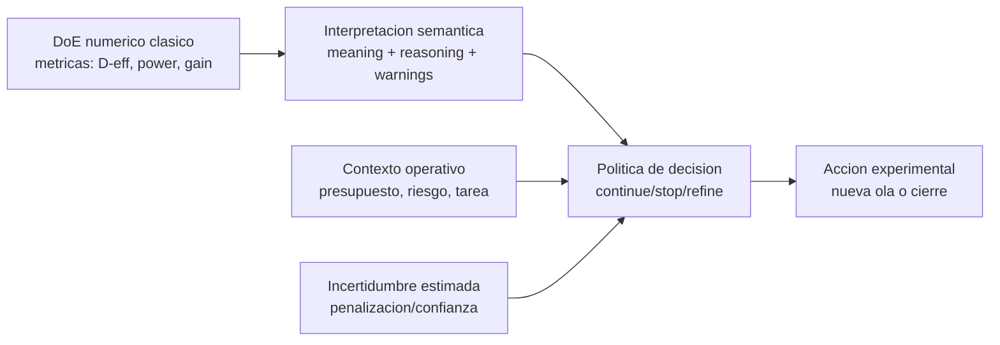
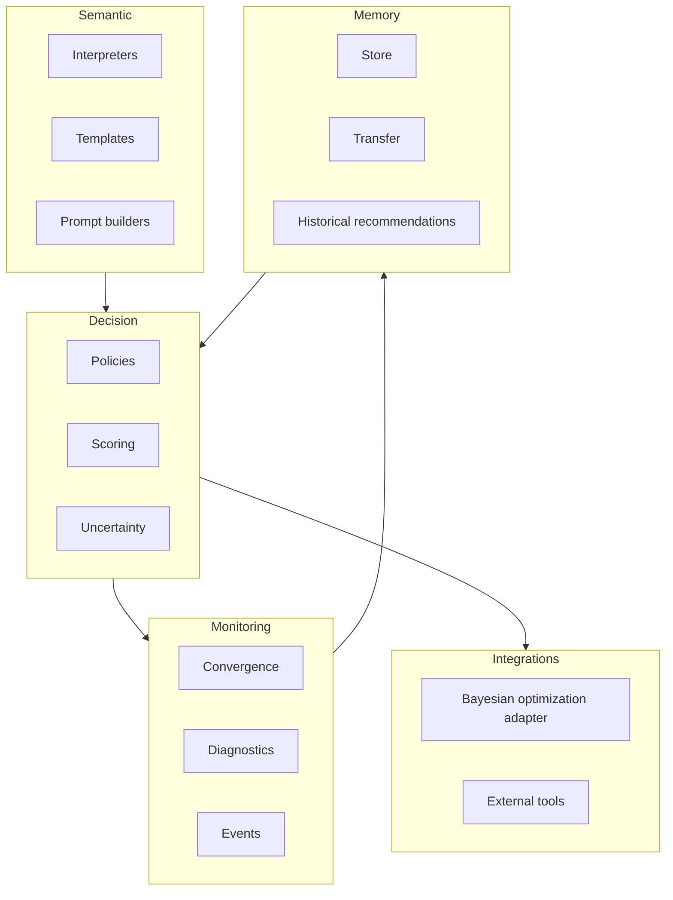
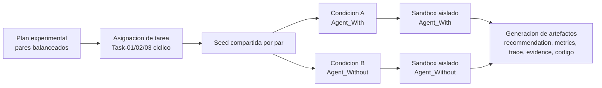
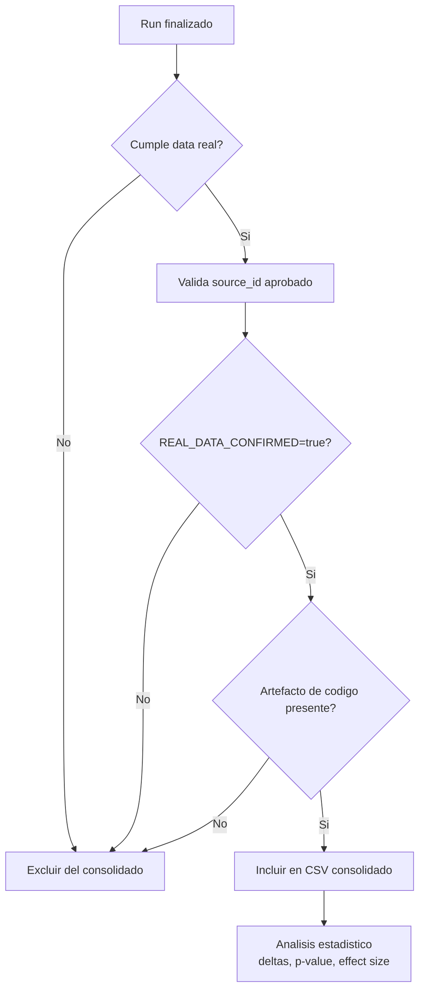
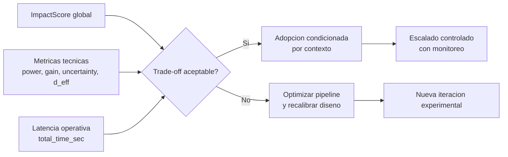
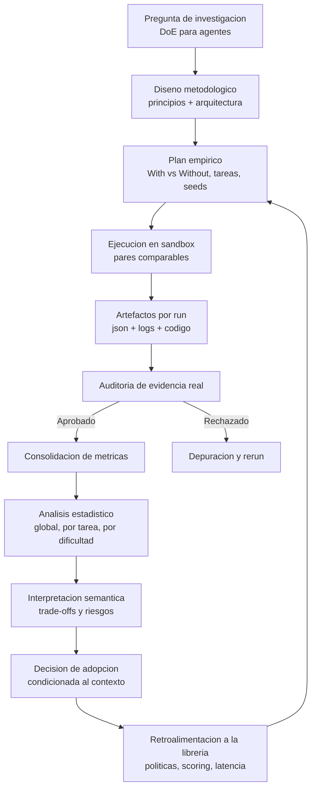

# Figuras Mermaid para IMRaD

Este documento propone figuras por etapas metodologicas y una figura global final del flujo completo de informacion.

## Figura 1. Etapa conceptual: de salida numerica a decision para agentes

Mensaje metodologico:
- El valor de la extension no es reemplazar DoE, sino traducir evidencia cuantitativa en decisiones operables por agentes.

## Figura 2. Etapa de arquitectura modular de la libreria

Mensaje metodologico:
- La arquitectura separa responsabilidades y permite autonomia progresiva sin acoplamiento rigido.

## Figura 3. Etapa de diseno empirico (With vs Without)

Mensaje metodologico:
- La comparabilidad se protege por pareo, misma tarea/seed y reglas simetricas de ejecucion.

## Figura 4. Etapa de auditoria y consolidacion de evidencia real

Mensaje metodologico:
- No hay inferencia final sin trazabilidad verificable de evidencia.

## Figura 5. Etapa de lectura de resultados y criterio de adopcion

Mensaje metodologico:
- La decision de adopcion es multiobjetivo, no monotona en una sola metrica.

## Figura 6. Flujo global completo de informacion (end-to-end)

Mensaje metodologico:
- El sistema completo funciona como ciclo de evidencia: diseno, ejecucion, auditoria, inferencia, decision y mejora continua.

## Sugerencia de ubicacion en IMRaD
1. Introduccion: Figura 1.
2. Metodos: Figuras 2, 3 y 4.
3. Resultados/Discusion: Figura 5.
4. Cierre metodologico o apendice: Figura 6.
